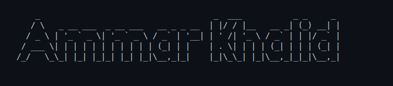

# Hi there 👋

I'm a Computer Science student with a strong interest in Machine Learning and Data Science. I enjoy working with Python and Jupyter Notebook to explore data, build models, and solve interesting problems. I'm always looking forward to collaborate on interesting projects

## Tech Stack

  
  
  
  
  
  
  
  
  

## Social

## Software I Use

  
  
  
  

## GitHub Stats

